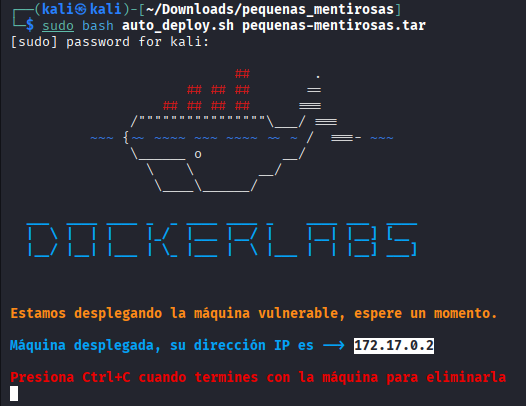
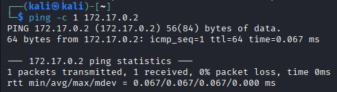
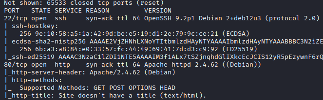
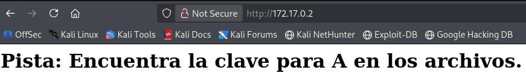
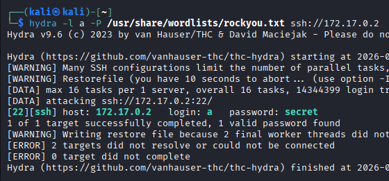
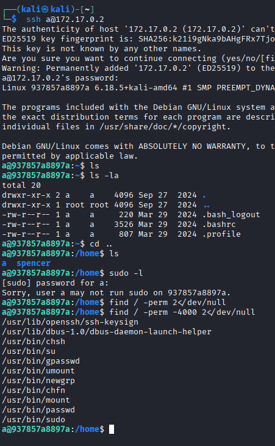
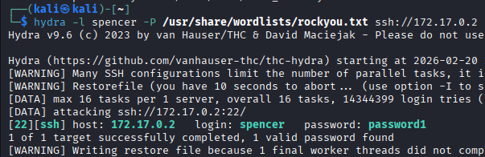
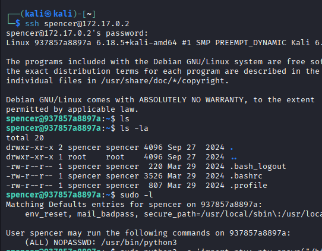
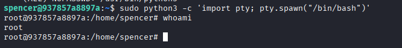

# pequenas-mentirosas - DockerLabs

## 📌 Información General

- **Nombre:** pequenas-mentirosas  
- **Dificultad:** Fácil  
- **Plataforma:** DockerLabs  

---

## 🔎 Reconocimiento

Tenemos la maquina pequenas-mentirosas de DockerLabs nivel facil

---

Se ejecuta un comando ping contra el objetivo y se obtiene un TTL=64, valor típicamente asociado a sistemas operativos basados en Linux, lo que nos permite inferir el posible sistema operativo del host.

---

nmap -p- --open -sS -sC -sV --min-rate 2000 -n -vvv -Pn 172.17.0.2

Se ejecuta un escaneo con nmap contra el objetivo, identificando los puertos 22 (SSH) y 80 (HTTP) en estado open, lo que indica que ambos servicios se encuentran activos y accesibles.

---

## 🌐 Enumeración Web

Procedemos a introducir la dirección IP de la víctima en el navegador y observamos un mensaje con la siguiente pista: "Encuentra la clave para a en los archivos".  
Esto nos permite inferir que podría existir un usuario llamado a.

---

## 🔐 Acceso Inicial

Se ejecuta un ataque de fuerza bruta utilizando la herramienta hydra contra el servicio identificado previamente. Como resultado, se obtiene la credencial válida del usuario a, cuya contraseña es secret.

---

Se accede al sistema mediante SSH con las credenciales obtenidas previamente.  

Al ejecutar el comando sudo -l, se observa que el usuario actual no tiene permisos para ejecutar comandos con privilegios elevados.  

Posteriormente, se realiza una búsqueda de binarios con el bit SUID activo mediante el comando find / -perm -4000 2>/dev/null, sin identificar archivos sospechosos o fuera de lo común.  

Finalmente, al enumerar los usuarios del sistema, se detecta la existencia de otro usuario llamado spencer, lo que abre una posible vía para continuar con la escalada de privilegios.

---

## 🔓 Movimiento Lateral

Se ejecuta un ataque de fuerza bruta con la herramienta hydra contra el usuario spencer. Como resultado del ataque, se obtiene acceso válido, revelando que la contraseña asociada al usuario es password1.

---

## 🚀 Escalada de Privilegios

Tras autenticarnos vía SSH como spencer, se realiza una enumeración básica del directorio personal sin encontrar información relevante.  

Al ejecutar sudo -l, se identifica que el usuario tiene permitido ejecutar /usr/bin/python3 como cualquier usuario (ALL) bajo la directiva NOPASSWD, lo que representa un claro vector para la escalada de privilegios.

---

Dado que el usuario puede ejecutar /usr/bin/python3 con privilegios elevados, se procede a investigar posibles técnicas de escalada asociadas a este binario. Para ello, se realiza una revisión de documentación técnica y recursos especializados que describen métodos de explotación mediante intérpretes de Python ejecutados con permisos de superusuario.

---

sudo python3 -c 'import pty; pty.spawn("/bin/bash")'

Este comando permite generar una nueva shell interactiva con privilegios elevados.  

Posteriormente, al ejecutar whoami, se confirma que el usuario actual es root, completando exitosamente la escalada de privilegios.
